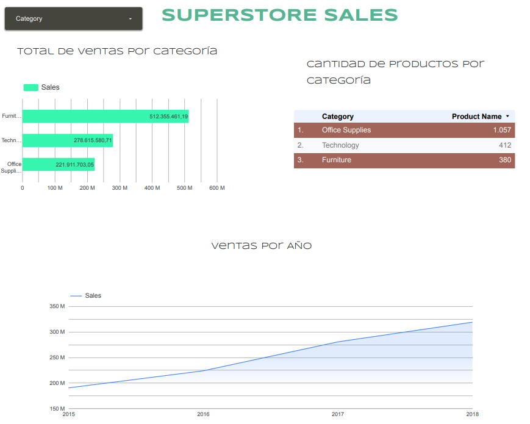
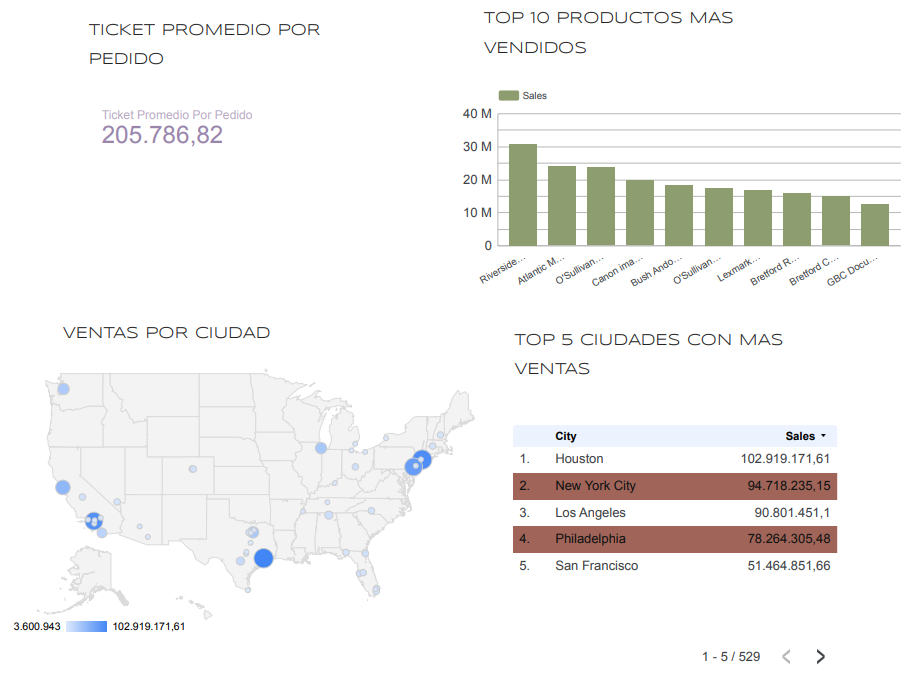
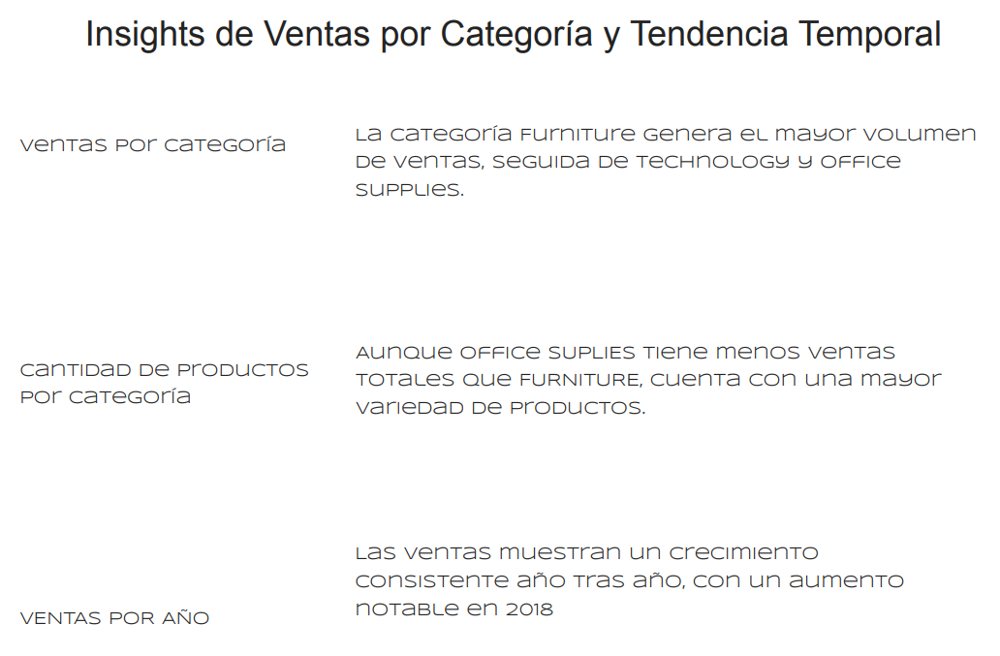
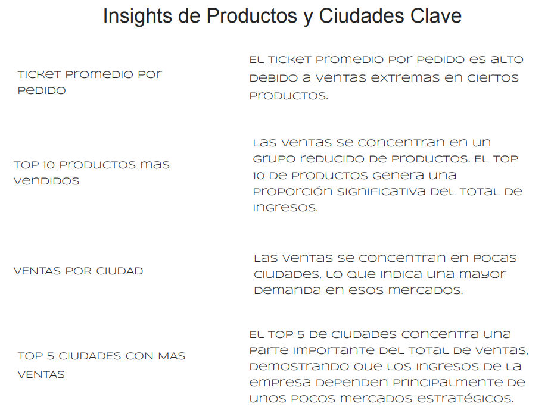

#  Análisis de Ventas – Looker Studio

##  Descripción
Proyecto de análisis de datos desarrollado en Looker Studio.
El dashboard cuenta con **4 páginas**, separando visualización y análisis para una mejor toma de decisiones.

##  Dashboard interactivo
 https://lookerstudio.google.com/reporting/b138a14c-899b-4e60-8638-80c2cf161575

##  Páginas del dashboard

###  Gráficos – Visión General

###  Gráficos – Análisis Comercial

###  Insights – Ventas y Tendencia Temporal

###  Insights – Productos y Ciudades Clave

